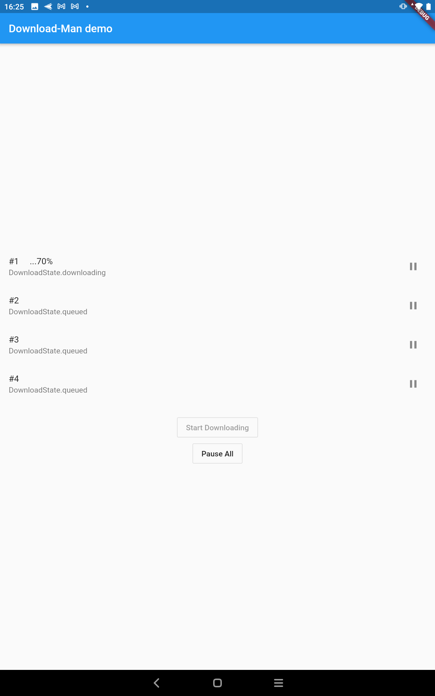

[This repository is no longer maintained, code still needs to be cleaned well, adding Unit tests ... etc]

# Big files downloader (in Pure dart)

## Tested on Android & iOS and should work on all platforms
a small downloader using Dio range download with DownloadMan Service which controls the queue, pauses all or pause a single file.

# Features

1.Resumable downloads

2.fast download while it splits the file into small chunks and downloads them in parallel

3.easy to implement

4.Queue Downloads

5.parallel files download (Not yet implemented)

6.background fetch(Not yet implemented)

# Workflow

1. download a small chunk (1 byte) to check the total file size

2. split files more than 10 Mb to chunks (FileSize/10Mb) with max of 16 chunk

3. resumes the chunk if its already been (fully/partially) downloaded before

4. emits progress updates (DownloadMan.streamController) =>
(String downloadId, int prettyProgress,  int total,int count, int chunksCount,DownloadState downloadState)

# DownloadState

enum { unknown, queued, downloading, failed, completed, paused }

# How to use

1.inistaniate DownloadMan Service final downloadMan = Get.put(DownloadMan());.

2.create needed directories => final finalDir = await _createDir();.

3.add a new download request => downloadMan.addToDownload('downloadId',url,finalDir+'/filename.ext');.

4.listen to the updates downloadMan.streamController.stream.listen((event) {...});.

# Hints
*For Best UI Results add the Events(destination file and downloadId ... etc) to your real-time database, ObjectBox for example))
PS. if you download the file inside the app sandbox then you don't need storage permission.
## Don't forget to give a star and follow))

